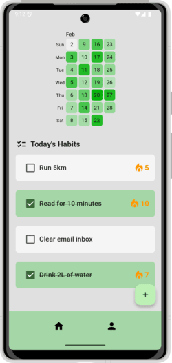
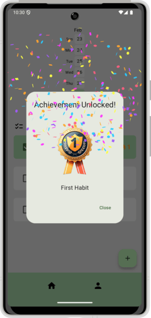
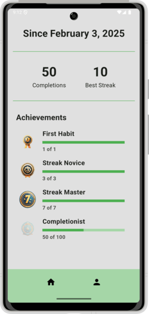
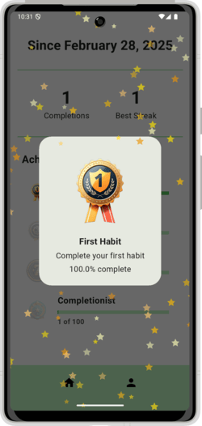

# TrackIt – Simple & Fun Habit Tracker  

**TrackIt** is a lightweight, engaging habit tracker that helps you build and maintain daily habits effortlessly. No sign-ups, no accounts—just open the app and start tracking! 🚀 

## 📑 Contents

- [Features](#features)  
- [Tech Stack](#tech-stack)  
- [Goals & Scope](#goals)  
- [Showcase](#showcase)   
- [Getting Started](#getting-started) 
- [Summary of Design Decisions](#design-decisions)  
- [Feature Ideas & Constraints](#ideas) 
- [Challenges Faced](#challenges-faced)  
- [Acknowledgements](#acknowledgements)  

<a id="features"></a>

## ✨ Features 
- **Daily Habit Logging** – Mark your habit as complete every day.  
- **Habit Streaks** – Stay motivated with streak tracking.  
- **Calendar Heatmap View** – Visualize your progress over time.  
- **Engaging UI & Gamification** – Unlock achievements and enjoy a delightful tracking experience.
- **Offline Support** – Works completely offline with local storage.  

<a id="tech-stack"></a>

## 🖥️ Tech Stack  
- **Flutter** – Cross-platform mobile development  
- **Hive** – Local storage for tracking habits

<a id="goals"></a>

## 🎯 Goals & Scope
TrackIt is a single-user experience with no backend or authentication required. The focus is on delivering a seamless and enjoyable habit tracking interface. The app is designed to work fully offline, allowing users to track their habits anytime, anywhere.

<a id="showcase"></a>

## 🏆 Showcase
### Deployed Web App
You can try TrackIt on the web! Check out the deployed version [here](https://trackit-habittracker.web.app/) and explore how it can help you build and maintain your daily habits.

### Screenshots
Below are some screenshots showcasing the key features of TrackIt:

### Home Screen
This is where you can view your daily habits and mark them as complete. You can also create (by **tapping on the + button**), edit, and delete habits (by **sliding each habit to the left**).

|  |  |
|-------|------|
|  | **Heatmap**: The Heatmap visualizes your progress over time. It uses a color gradient to show how many habits you have completed each day. The darker the color, the more habits you have completed. <br><br> **Streaks**: Your Streaks are tracked to motivate you. Every day you complete a habit, your streak increases. |
|  | **Achievement Unlocked**: As you continue to track and complete your habits, you will unlock various achievements. |

### Profile Screen
This is where you can see your achievements and progress in one place. It gives you a high-level overview of your journey and rewards you for consistency.

|  |  |
|-------|------|
|  | **Achievements**: On the **Profile Screen**, you can view the achievements you have unlocked. These achievements act as badges that showcase your progress and dedication in building habits. <br><br> For instance: <br><br> **First Habit:** Awarded for completing your first habit. <br><br> **Streak Master:** Awarded for reaching a streak of 7 days. <br><br> **Completionist:** Awarded after completing 100 habits. |
|  | **Achievements View**: Tap on each achievement to view a more detailed description of it. |

<a id="getting-started"></a>

## 🚀 Getting Started  
### Prerequisites  
- Install [Flutter](https://flutter.dev/docs/get-started/install)

### Running the App
- Clone the repository:  
  ```bash  
  git clone https://github.com/SQ77/trackIt.git  
  cd trackIt  
  ```  
- Install dependencies:  
  ```bash  
  flutter pub get  
  ```  
- Run the app:  
  ```bash  
  flutter run  
  ```

<a id="design-decisions"></a>

## 📜 Summary of Design Decisions  
- **Minimalist yet Fun UI:** A balance between simplicity and engagement through animations and gamification.
- **Optimized for Quick Logging:** Users can log habits with minimal effort to encourage consistency.
- **Local Storage:** Ensuring a smooth offline experience with Hive.

<a id="ideas"></a>

## Feature Ideas & Constraints

This section documents potential features or tasks that could significantly enhance the app but were unable to be implemented due to time constraints. These are ideas or improvements that the development team would consider adding in the future, based on time, resources, or priority.

### Potential Features

- **Interactive Dashboard**  
A more detailed dashboard for tracking user progress, displaying data visualizations like graphs for streaks, and completed habits over time.

- **Social Sharing**  
The ability to share achievements and completed habits on social media. Users could share a post or badge showing off their progress, increasing visibility and encouraging engagement.

- **Customizable Notifications**  
Let users set personalized reminders and notifications for specific habits, including options for push notifications, in-app reminders, or emails.

- **Habit History & Trends**  
A history feature that shows trends in the user’s habit data, such as how often certain habits were completed over time. It would allow users to reflect on their consistency and identify patterns in their behavior.

- **Engaging Animations**  
Enhance the user experience with more engaging and dynamic animations, such as the 3D rotation effect on achievement badges, similar to Apple Fitness.

### Constraints

- **Limited Time for Implementation**  
  Due to limited time, only core features (like tracking completed habits and achievement system) were prioritized. More advanced features, such as personalized progress tracking, could not be implemented within the current project timeline.

- **User Customization**  
  Customizing habit categories or personalizing the look and feel of the app is an idea for future improvements. However, this would require extra development resources and time that were unavailable in the current scope.

## Challenges Faced

1. Learning Flutter and Dart

Since this was my first project using Flutter and Dart, there was a learning curve in understanding Flutter's widget tree, state management, and how Dart handles asynchronous operations. Adapting to Flutter’s declarative UI approach took some time but was a rewarding experience.

2. Creating a Minimalist yet Fun UI

Striking a balance between a simple, clutter-free design and an engaging user experience was a challenge. I aimed to keep the interface minimal while incorporating animations and gamification elements to make habit tracking more enjoyable. 

## Acknowledgements

- [OpenArt.ai](https://openart.ai/home): Generating images for the achievement badges
- [Mitch Koko](https://www.youtube.com/@createdbykoko): Habit tracker tutorial